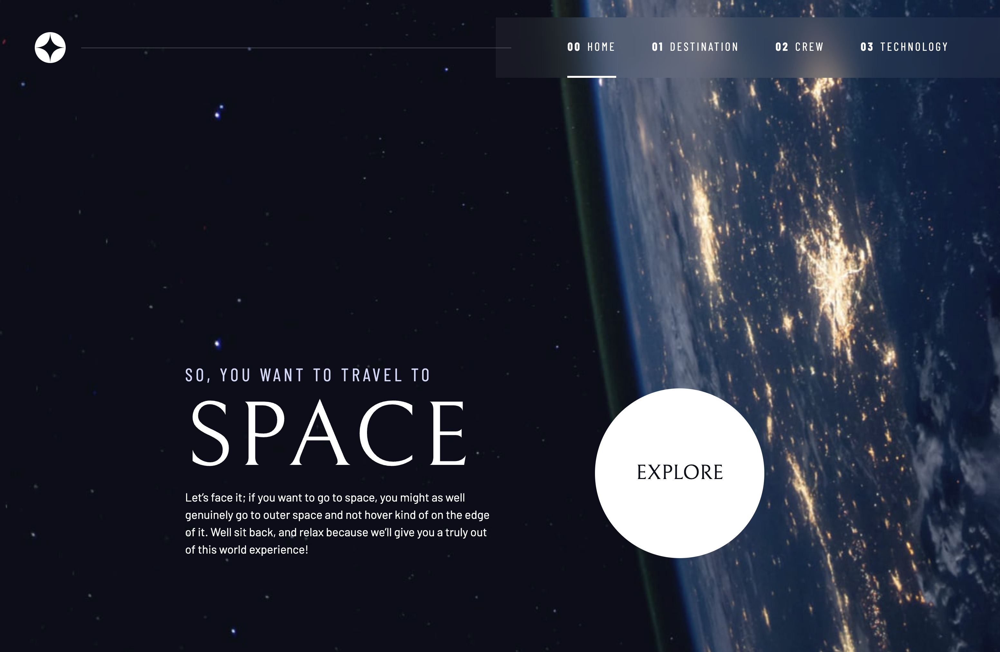
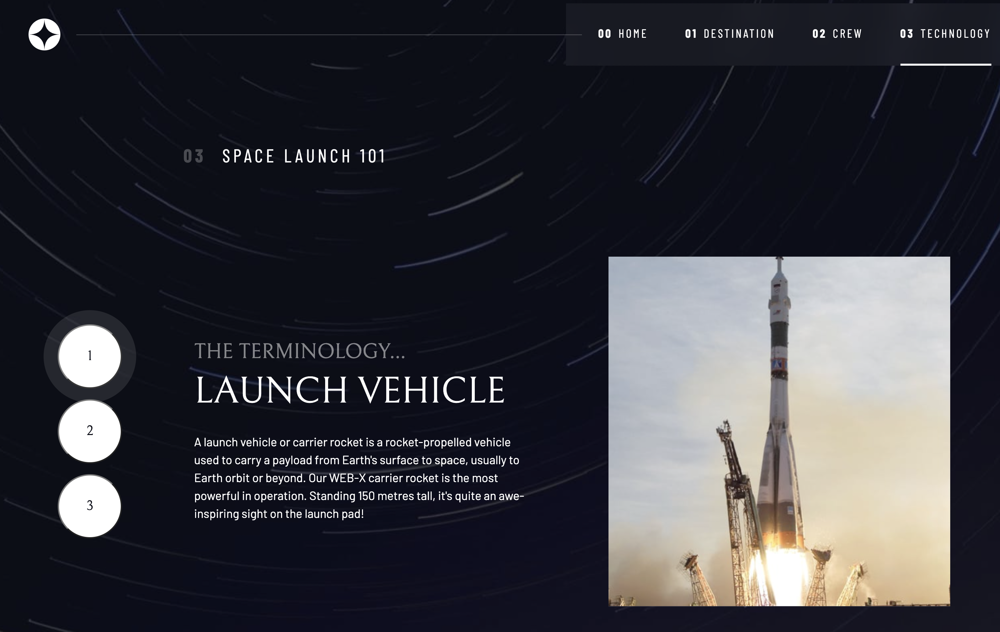

# Space Website

## The Mission

The challenge is to build a multi-page space tourism website and get it to look as close to the model as possible.

## The Result

The Website contains four pages: Home, Destination, Crew and Technology.

At the Home-Page you can step into the Destination-Page with the "Explore"-Button, or evenly with the Navigation-Bar.

At the Destination-Page you see four further tabs with Moon, Mars, Europa and Titan. You can choose the tabs with the left or right arrowkey and hit the space key. You of course also can click with the mouse.

At the Crew-Page you can choose the severel crew-members by the dot-indicators, also with the arrowkeys or the mouse.

Finally the Technology-Page contains also three tabs, designed as round numbered buttons vertically. You can choose as before.

The changing content an pictures are built with JavaScript.

The Website is responsive for full screen, tablet and mobile.

The design is built with CSS.
